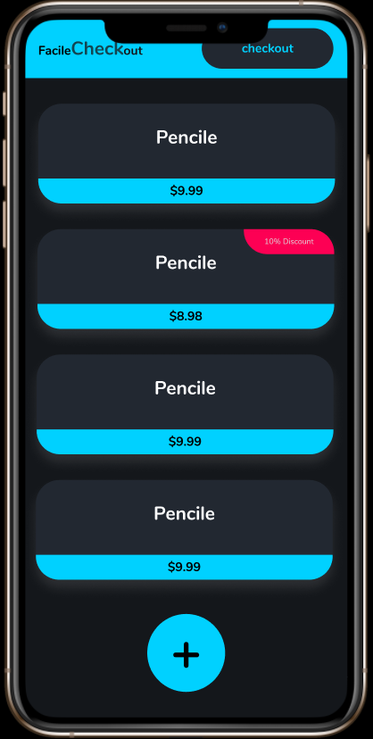

<h1>CSC301</h1>
<h2>Assignment 1</h2>
<h3>Patrick Vuscan and Mohammad Darabi</h3>

Git Commmit Messaging Standard:
<http://karma-runner.github.io/0.10/dev/git-commit-msg.html>

<p>&nbsp;</p>
<p>&nbsp;</p>

<h1 align="center">Welcome to Facile-Checkout 👋</h1>
<p>
  
  <a href="https://github.com/csc301-fall-2020/assignment-1-65-patrickvuscan-mohammaddarabi#readme" target="_blank">
    
  </a>
  <a href="https://github.com/csc301-fall-2020/assignment-1-65-patrickvuscan-mohammaddarabi/graphs/commit-activity" target="_blank">
    
  </a>
  <a href="#" target="_blank">
    
  </a>
</p>

> A simple checkout system



### 🏠 [Homepage](github.io)

### ✨ [Demo](github.io)

<p>&nbsp;</p>
<p>&nbsp;</p>

## Running this project:

Inside of the root folder, run

```sh
npm install
```

Then inside the root folder create a `.env` file and copy in:

```
SKIP_PREFLIGHT_CHECK=true
```

Afterwards, go into `api/prisma/`, and create another `.env` file with the contents:

```
DATABASE_URL=...
```

With a database URL provided by a project owner. Afterwards backout into the `api/` directory and call

```sh
npm install
npm start
```

Then backout, and go into the `app/` directory, and once again call

```sh
npm install
npm start
```

You should now be running the project locally.

## Run tests

```sh
npm run test
```

## Author

-   Github: [@mhd53](https://github.com/mhd53), [@PatrickVuscan](https://github.com/PatrickVuscan)

## Show your support

Give a ⭐️ if this project helped you!

---
